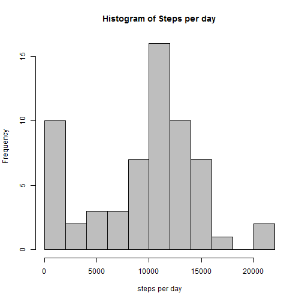
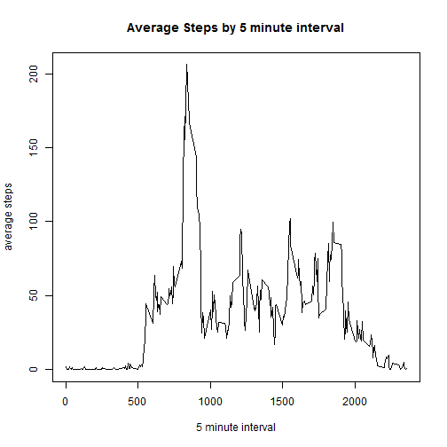
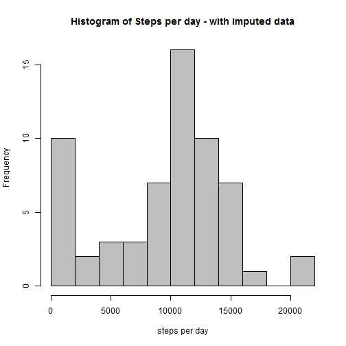
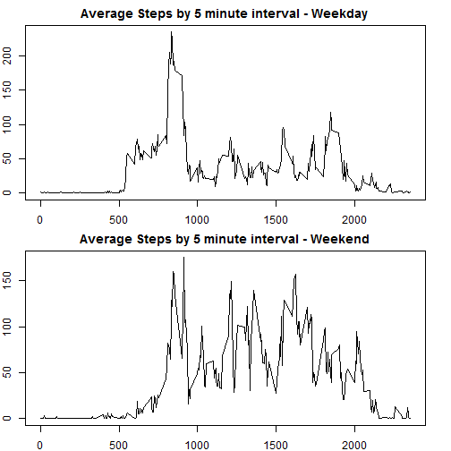

#Summary 

This is a report summarizing 2 months of data from a personal activity monitoring device. The variables in the original dataset 'activity' were steps, date, and 5 minute interval. This report will summarize:  

 * total, mean, and median steps per day (with and without imputed missing data)  
 * the average daily pattern of steps by 5 minute interval  
 * comparisons of average daily pattern for weekdays vs. weekends.


##Loading the Data


```r
activity <- read.csv("activity.csv")
```

##Total steps per day and mean/median steps per day


```r
total <- aggregate (activity$steps, by=list(activity$date), FUN=sum, na.rm=TRUE)
names(total) <- c("date", "steps")
hist(total$steps, breaks = 10, col="grey", xlab = "steps per day", main="Histogram of Steps per day") 
```



```r
mean(total$steps)
```

```
## [1] 9354.23
```

```r
median(total$steps)
```

```
## [1] 10395
```

##Average daily pattern - time series plot and highest activity interval


```r
avgsteps <- aggregate(activity$steps, by=list(activity$interval), FUN=mean, na.rm=TRUE)
names(avgsteps) <- c("interval", "steps")
plot(avgsteps$interval, avgsteps$steps, type = "l", xlab="5 minute interval", 
     ylab="average steps")
title("Average Steps by 5 minute interval")
```



```r
avgsteps[which.max(avgsteps$steps),]
```

```
##     interval    steps
## 104      835 206.1698
```

##Imputing missing data


```r
sum(is.na(activity$steps))
```

```
## [1] 2304
```

```r
#replace NA's with mean steps per interval
steps.na <- function(step, minute) {
  impute <- NA
  if (!is.na(step))
    impute <- c(step)
    else impute <- avgsteps[avgsteps$interval == minute, "steps"]
  return(impute)
}
activity.imp <- activity
activity.imp$newsteps <- mapply(steps.na, activity.imp$steps, activity.imp$interval)
```


##Total steps per day and mean/median steps per day (imputed data)


```r
total.imp <- aggregate(activity.imp$steps, by=list(activity.imp$date), FUN=sum, na.rm=TRUE)
names(total.imp) <- c("date", "steps")
hist(total.imp$steps, breaks = 10, col="grey", xlab = "steps per day", main="Histogram of Steps per day - with imputed data") 
```



```r
mean(total.imp$steps)
```

```
## [1] 9354.23
```

```r
median(total.imp$steps)
```

```
## [1] 10395
```

##Comparing weekend and weekday activity

###Data set up


```r
activity.imp$mdy <- mdy(activity.imp$date)
activity.imp$weekday <- as.factor(weekdays(activity.imp$mdy))
weekend <- c("Saturday", "Sunday")
activity.imp$wkdf <- factor(activity.imp$weekday %in% weekend, levels=c("TRUE", "FALSE"),
      labels=c("weekend","weekday"))
act_wkend <- subset(activity.imp, wkdf == "weekend")
act_wkd <- subset(activity.imp, wkdf == "weekday")
```

###Plots of comparison


```r
par(mfrow=c(2,1)) 
par(mar=c(2,2,2,2))
#weekday
avgsteps_wd <- aggregate(act_wkd$steps, by=list(act_wkd$interval), FUN=mean, na.rm=TRUE)
names(avgsteps_wd) <- c("interval", "steps")
plot(avgsteps_wd$interval, avgsteps_wd$steps, type = "l", xlab="5 minute interval", 
     ylab="average steps")
title("Average Steps by 5 minute interval - Weekday") 
#weekend
avgsteps_we <- aggregate(act_wkend$steps, by=list(act_wkend$interval), FUN=mean, na.rm=TRUE)
names(avgsteps_we) <- c("interval", "steps")
plot(avgsteps_we$interval, avgsteps_we$steps, type = "l", xlab="5 minute interval", 
     ylab="average steps")
title("Average Steps by 5 minute interval - Weekend") 
```



